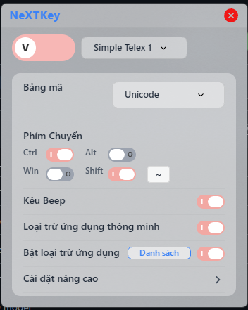
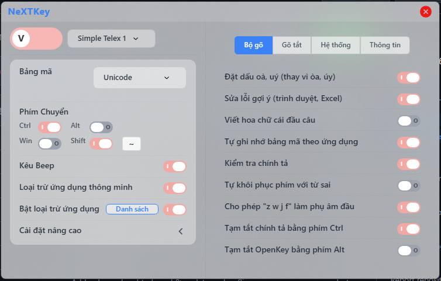

# OpenKey (Phiên bản cải tiến)

Đây là phiên bản fork từ dự án [OpenKey gốc](https://github.com/tuyenvm/OpenKey) của tác giả Mai Vũ Tuyên.
Phiên bản này được phát triển tiếp để bổ sung các tính năng mới và sửa lỗi cho người dùng Windows.

## 💡 Về dự án

Đây là một dự án **phát triển cá nhân** với mục đích phục vụ nhu cầu sử dụng của bản thân mình. Sau khi sử dụng và cải tiến, mình nhận thấy nhiều người dùng cũng gặp những vấn đề tương tự, nên quyết định chia sẻ và cố gắng hỗ trợ cộng đồng.

Dự án được phát triển với tinh thần mã nguồn mở, mọi đóng góp và phản hồi từ cộng đồng đều được hoan nghênh.

> **Lưu ý:** Dự án này kế thừa từ OpenKey gốc. Nếu bạn yêu thích phần mềm và muốn ủng hộ tác giả gốc, vui lòng truy cập: [Donate cho tác giả Mai Vũ Tuyên](https://tuyenvm.github.io/donate.html).

## ✨ Tính năng mới trong phiên bản này

### 1. 🛡️ Loại trừ ứng dụng (English Only Mode)
Tính năng này cực kỳ hữu ích cho lập trình viên hoặc game thủ:
- **Chức năng**: Cho phép lập danh sách các ứng dụng "loại trừ" (ví dụ: Visual Studio Code, Terminal, CMD, CS:GO...).
- **Hoạt động**: Khi bạn chuyển cửa sổ sang các ứng dụng trong danh sách này, OpenKey sẽ **tự động chuyển sang chế độ gõ Tiếng Anh** và **khóa phím tắt** chuyển đổi ngôn ngữ. Điều này giúp tránh việc vô tình gõ tiếng Việt khi đang code hoặc chơi game.
- **Quản lý**: Dễ dàng thêm/xóa ứng dụng thông qua giao diện quản lý (có thể thêm nhanh ứng dụng đang mở hoặc nhập tay tên file .exe).

### 2. 🐞 Sửa lỗi khởi động cùng Windows
- Khắc phục hoàn toàn lỗi OpenKey không thể tự khởi động cùng Windows khi chạy dưới quyền Administrator nếu đường dẫn thư mục cài đặt có chứa khoảng trắng (Space).

### 3. ⚡ Tối ưu hiệu năng (Performance)
Phiên bản này đã được tối ưu sâu để hoạt động mượt mà, ổn định và nhẹ nhàng hơn:

- 🚀 **Tối ưu chế độ gõ tiếng Anh**: Giảm tải CPU tối đa khi không gõ tiếng Việt.
- 🎯 **Sửa lỗi lag trên ứng dụng Qt/Electron**: Khắc phục hoàn toàn hiện tượng trễ ký tự đầu tiên trên NotepadNext, VSCode, Discord...
- 🔍 **Tối ưu tra cứu**: Tăng tốc độ phản hồi khi gõ tiếng Việt.
- ⌨️ **Tối ưu phím tắt**: Xử lý mượt mà các phím tắt hệ thống (Ctrl+C, Alt+Tab...).

> 👉 Xem chi tiết kỹ thuật tại [OPTIMIZATION_DETAILS.md](Docs/OPTIMIZATION_DETAILS.md)

### 4. 🔓 Sửa lỗi phím tắt sau khi Lock/Unlock Windows
Khắc phục hoàn toàn lỗi phím tắt chuyển Anh-Việt không hoạt động sau khi khóa màn hình (Win+L) và đăng nhập lại:

> 👉 Xem chi tiết kỹ thuật tại [LOCK_SCREEN_FIX.md](Docs/LOCK_SCREEN_FIX.md)

### 5. ⌨️ Sửa lỗi không gõ được tiếng Việt sau khi xóa ký tự (Backspace)
Khắc phục lỗi nghiêm trọng khi người dùng gõ nhầm và xóa (backspace) để sửa lại, engine tự động chuyển sang chế độ tiếng Anh và không cho phép gõ tiếng Việt nữa.

> 👉 Xem chi tiết kỹ thuật tại [BACKSPACE_BUG_FIX.md](Docs/BACKSPACE_BUG_FIX.md)

### 6. 🎨 Giao diện NextKey (Modern UI with Glassmorphism)
Thiết kế lại hoàn toàn giao diện người dùng với phong cách hiện đại:
- **Glassmorphism Design**: Hiệu ứng kính mờ (frosted glass) với độ trong suốt và blur tinh tế.
- **Pastel Color Palette**: Bảng màu pastel nhẹ nhàng, dễ nhìn trong thời gian dài.
- **Responsive Layout**: Giao diện tự điều chỉnh với panel Settings compact và Advanced settings mở rộng.
- **Modern Toggle Switches**: Công tắc bật/tắt kiểu iOS với animation mượt mà.
- **Tab Navigation**: Phân chia cài đặt theo tabs: Bộ gõ, Gõ tắt, Hệ thống, Thông tin.
- **Real-time V/E Toggle**: Đồng bộ trạng thái Anh/Việt realtime giữa tray icon và UI.

> 🎨 Được xây dựng trên nền tảng **Sciter** - HTML/CSS rendering engine nhẹ và nhanh.

  
  

<em>Giao diện NextKey: Chế độ compact (trái) và mở rộng với Advanced Settings (phải)</em>

---

## 🌟 Các tính năng chính (Kế thừa từ OpenKey gốc)

OpenKey là bộ gõ tiếng Việt hiện đại, mã nguồn mở với nhiều tính năng mạnh mẽ:

### ⌨️ Hỗ trợ gõ
- **Kiểu gõ**: Telex, VNI, Simple Telex.
- **Bảng mã**: Unicode (Dựng sẵn), TCVN3 (ABC), VNI Windows, Unicode tổ hợp...

### 🧠 Tính năng thông minh
- **Modern Orthography**: Tùy chọn đặt dấu oà, uý (mới) thay vì òa, úy (cũ).
- **Smart Switch Key**: Tự động ghi nhớ chế độ gõ (Anh/Việt) cho từng ứng dụng riêng biệt.
- **Kiểm tra chính tả & Ngữ pháp**: Phát hiện và xử lý lỗi chính tả cơ bản.
- **Macro (Gõ tắt)**: Hỗ trợ gõ tắt không giới hạn ký tự, giúp tăng tốc độ soạn thảo.
- **Quick Telex**: Hỗ trợ gõ tắt nhanh các phụ âm đầu/cuối (cc=ch, gg=gi, kk=kh...).
- **Phục hồi từ sai**: Tự động khôi phục phím đã gõ nếu từ đó không hợp lệ.

### 🛠️ Tiện ích hệ thống
- **Gửi từng phím**: Chế độ tương thích cao cho các ứng dụng/game kén bộ gõ.
- **Run as Admin**: Hỗ trợ chạy với quyền quản trị cao nhất.
- **Công cụ chuyển mã**: Tích hợp sẵn công cụ chuyển đổi văn bản giữa các bảng mã (Ctrl+Shift+F9).
- **Tự động cập nhật**: Kiểm tra và cập nhật phiên bản mới.

## 📥 Cài đặt & Sử dụng

1. Tải về phiên bản mới nhất từ mục Releases.
2. Giải nén và chạy file `OpenKey.exe`.
3. (Khuyên dùng) Nên tắt các bộ gõ tiếng Việt khác (Unikey, EVKey...) để tránh xung đột.

## 📜 Mã nguồn & Giấy phép

Mã nguồn của ứng dụng được mở công khai dưới giấy phép **GPL**. Bạn có thể tự do tải về, nghiên cứu và phát triển tiếp, miễn là tuân thủ các điều khoản của giấy phép nguồn mở.
