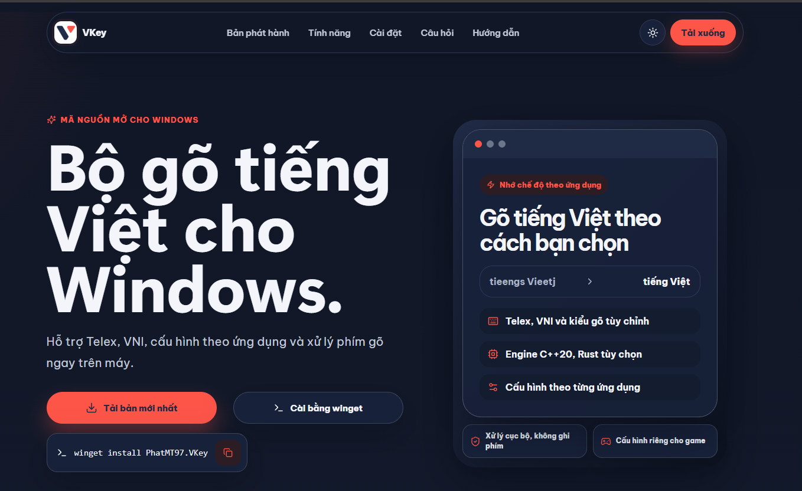

# VKey - Bộ gõ tiếng Việt hiện đại cho Windows

[](https://www.vkey.qd.je)
[](https://github.com/phatMT97/VKey/actions/workflows/build.yml)
[](https://www.gnu.org/licenses/gpl-3.0)
[](https://github.com/phatMT97/VKey/releases)

<p align="center">
  <a href="https://www.vkey.qd.je" target="_blank">
    
  </a>
</p>
<p align="center">
  🌐 <strong>Trang chủ chính thức: <a href="https://www.vkey.qd.je" target="_blank">www.vkey.qd.je</a></strong> — Giới thiệu trực quan, hướng dẫn sử dụng, tra cứu tính năng & tải về bản phát hành mới nhất
</p>

<p align="center">
  
  
</p>
<p align="center"><em>Giao diện VKey: Chế độ thu gọn (trái) và Cài đặt mở rộng (phải)</em></p>

<p align="center">
  
</p>
<p align="center"><em>Giao diện đầy đủ VKey</em></p>

<p align="center">
  
</p>
<p align="center"><em>Giao diện Classic (Win32 native) — nhẹ, tương thích cao</em></p>

---

**[🌐 Trang chủ](https://www.vkey.qd.je)** | **[Giới thiệu](#giới-thiệu)** | **[Hướng dẫn sử dụng](https://www.vkey.qd.je/guide/)** | **[Tính năng](#tính-năng)** | **[Cài đặt](#cài-đặt)** | **[Xác minh](#xác-minh-bản-tải-verify-release)** | **[Build](#build-từ-mã-nguồn)** | **[Kiến trúc](#kiến-trúc)** | **[English](#english-version)** | **[Credits](#credits)**

---

> [!TIP]
> **🌐 Trang chủ chính thức:** Ghé thăm **[www.vkey.qd.je](https://www.vkey.qd.je)** để trải nghiệm giao diện trực quan, sao chép nhanh lệnh `winget install PhatMT97.VKey` và tải các bản phát hành mới nhất!
>
> **📖 Hướng dẫn sử dụng:** Xem hướng dẫn chi tiết các tính năng, phím tắt và câu hỏi thường gặp (FAQ) tại **[Hướng dẫn sử dụng trực tuyến (vkey.qd.je/guide)](https://www.vkey.qd.je/guide/)** (hoặc xem bản tài liệu tại [GUIDE.md](docs/GUIDE.md)).

## Giới thiệu

**VKey** là bộ gõ tiếng Việt mã nguồn mở cho Windows, được viết lại từ hoàn toàn [NextKey](https://github.com/phatMT97/VKey/tree/feat/UI-Next) (một fork của [OpenKey](https://github.com/tuyenvm/OpenKey) của Mai Vũ Tuyên).

Engine mới, kiến trúc mới, C++20, hiệu năng cao, giao diện Glassmorphism.

> Engine VKey được tối ưu dựa trên nghiên cứu ngữ âm học tiếng Việt, có tham khảo mã nguồn [Unikey](https://www.unikey.org/source.html) của bác **Phạm Kim Long** cho các quy tắc âm vị học (VCPair, consonant restrictions). Xin chân thành cảm ơn!

<a name="privacy-policy"></a>
### Chính sách bảo mật
* **Không ghi phím:** VKey không thu thập, lưu trữ, hay gửi phím bạn gõ đi đâu.
* **Không thu thập dữ liệu:** Không có dữ liệu cá nhân nào được gửi lên server.
* **Hoạt động offline:** Phần mềm hoạt động hoàn toàn cục bộ trên máy bạn.
* **Mã nguồn mở:** Bạn có thể tự kiểm chứng bằng cách đọc mã nguồn.
* **Minh bạch về Engine Kiểm tra Chính tả Nâng cao:** Từ phiên bản v4.3, VKey tích hợp thêm một thư viện nguồn đóng tùy chọn viết bằng Rust phục vụ riêng cho chức năng tự sửa lỗi chính tả nâng cao. Tính năng này mặc định được tắt và người dùng có toàn quyền kiểm soát hoặc xóa bỏ. Riêng **bản Classic phát hành chính thức là 100% mã nguồn mở (Open Source)**, được build độc lập với Rust tắt hoàn toàn và không thể nạp engine này. Maintainer có thể tạo một biến thể Classic + Rust chỉ để kiểm thử bằng manual workflow, nhưng biến thể đó không được ký và không phải sản phẩm Classic chính thức. Chi tiết lý do và tính minh bạch được giải thích tại **[ENGINE_ARCHITECTURE.md](docs/ENGINE_ARCHITECTURE.md)** và **[ENGINE_FAQ.md](docs/ENGINE_FAQ.md)**.

> **Lưu ý:** Dự án này được phát triển chủ yếu dựa trên nhu cầu và trải nghiệm cá nhân, vì vậy có thể vẫn tồn tại một số lỗi chưa được phát hiện hoặc khắc phục triệt để. Rất mong nhận được sự thông cảm và đóng góp ý kiến thông qua [Issue](https://github.com/phatMT97/VKey/issues) để bộ gõ ngày càng hoàn thiện hơn.

---

## 🚀 Key Features

* **Smart Switch per app**
  Tự động nhớ chế độ Việt/Anh theo từng ứng dụng

* **VKey Browser (thử nghiệm)**
  Tự động áp dụng chế độ mặc định, English hoặc TSF theo từng tên miền và đổi
  ngay khi chuyển tab. [Cài đặt extension](docs/BROWSER_EXTENSION.md)

* **App Exclusion (Hard / Soft)**
  Linh hoạt kiểm soát bật/tắt tiếng Việt theo app (phù hợp game, tool đặc thù)

* **Advanced Macro & Typing**
  Gõ tắt mở rộng (lên đến 20.000 ký tự, hỗ trợ xuống hàng), hoạt động cả trong English mode, hỗ trợ phụ âm nhanh

* **Telex + VNI Combined**
  Hỗ trợ gõ song song cả Telex và VNI mà không cần chuyển đổi

* **Spell Check + Free Typing**
  Kiểm tra chính tả tiếng Việt + cho phép override khi cần gõ tự do

* **Powerful Convert Tool**
  Bôi đen → chuyển mã nhanh, hỗ trợ nhiều kiểu chuyển đổi (HOA, thường, bỏ dấu…)

* **Per-App Configuration**
  Tùy chỉnh bảng mã & kiểu gõ riêng cho từng ứng dụng

* **Context-Aware Input**
  Tự tắt khi dùng CJK, phát hiện tiếng Anh để tránh lỗi gõ

* **Modern UI**
  Glassmorphism, auto Light/Dark, tùy biến icon, hỗ trợ song ngữ

* **High Performance Engine**
  Độ trễ thấp, hỗ trợ song song Hook Engine & TSF (Context-Aware) để bắt ngữ cảnh tốt nhất, auto update, [tối ưu bảo mật](docs/SECURITY.md)

* **Game-Friendly Telex**
  Bật **Chế độ game** cho game đó (một phím tắt, ngay trong game) là chơi với Telex bình thường — WASD di chuyển mượt, không cần chuyển Simple Telex hay tắt tiếng Việt. [Hướng dẫn](https://www.vkey.qd.je/guide/#game-mode)

* **Float icon in FullScreen**
  Hỗ trợ hiển thị icon status V/E nổi trên màn hình - thích hợp các app FullScreen

---

## Cài đặt

Bạn có thể tải trực tiếp từ **[Website chính thức](https://www.vkey.qd.je)** hoặc cài đặt theo các cách sau:

### Cách 1: Cài đặt nhanh qua WinGet (Khuyến nghị)
Mở Command Prompt hoặc PowerShell và chạy lệnh sau:
```powershell
# Cài đặt bản tiêu chuẩn (giao diện Sciter.JS)
winget install PhatMT97.VKey

# Hoặc cài đặt bản Classic (nhẹ, native Win32)
winget install PhatMT97.VKey.Classic
```

### Cách 2: Tải file Zip trực tiếp
1. Tải phiên bản mới nhất tại **[Releases](https://github.com/phatMT97/VKey/releases)**.
2. Giải nén và chạy `VKey.exe` (hoặc `VKeyClassic.exe` đối với bản Classic).

*(Khuyến nghị)* Tắt các bộ gõ khác (Unikey, EVKey) trước khi chạy để tránh xung đột.

### Extension trình duyệt thử nghiệm

> [!WARNING]
> Đây là tính năng thử nghiệm. Bản VKey sử dụng phải có
> `VKeyBrowserHost.exe` nằm cạnh `VKey.exe` hoặc `VKeyClassic.exe`.

1. Chạy VKey một lần để đăng ký native-messaging host.
2. Tải và giải nén [VKey-Browser](https://github.com/phatMT97/VKey-Browser).
3. Bật Developer mode tại `chrome://extensions`, `edge://extensions` hoặc
   `brave://extensions`, chọn **Load unpacked** rồi chọn thư mục có
   `manifest.json`. Với Firefox, chạy `npm run build:firefox`, mở
   `about:debugging#/runtime/this-firefox`, chọn **Load Temporary Add-on** và
   chọn `dist/firefox/manifest.json`.
4. Mở website và dùng hotkey V/E như bình thường; extension sẽ nhớ V/E theo
   hostname trong phiên. Bấm icon VKey Browser để đặt **Luôn gõ English
   (hard)** hoặc **TSF tương thích (hard)** khi cần rule cố định.

Công tắc **Bật điều hướng theo website** được bật mặc định. Có thể tắt để tạm
ngừng cả session mode lẫn hard rule mà không xóa chúng; VKey sẽ trở về hành vi
bình thường.

Ví dụ: đổi `google.com` sang V và `github.com` sang E bằng hotkey. Trong phiên
browser hiện tại, chuyển qua lại hai tab sẽ tự đổi V → E → V. Trạng thái học tự
xóa khi browser restart; hard rule vẫn được giữ. Xem protocol, giới hạn và cách
xử lý lỗi tại [docs/BROWSER_EXTENSION.md](docs/BROWSER_EXTENSION.md).

> **Ký số (Code signing) & Bản Classic:** 
> - Trong bản **v4.3, SignPath Foundation chỉ ký ba binary GPL-3.0 của gói Classic chính thức**: `VKeyClassic.exe`, `VKeyTSF.dll` và `VKeyWatchdog.exe`. Cả ba được tạo cùng nhau từ cấu hình Foundation riêng, với Engine Rust bị compile-out hoàn toàn và không có Sciter.
> - Phạm vi ký Foundation **không áp dụng** cho `VKey.exe`/VKeyApp, `sciter.dll`, installer, Engine Rust (`vkey_engine.dll`) hoặc bất kỳ thành phần proprietary nào. `VKeyBrowserHost.exe` có mã nguồn GPL-3.0 công khai nhưng không nằm trong request ba file hiện tại. Bản tiêu chuẩn (Sciter UI) v4.3 chưa được ký Authenticode; Windows SmartScreen có thể cảnh báo khi chạy lần đầu (chọn *More info* → *Run anyway*). Các bản v4.0–v4.2 trước đó đều được ký Authenticode đầy đủ.
> - Cách xác minh bản tải hiện nay: xem mục [Xác minh bản tải](#xác-minh-bản-tải-verify-release) bên dưới.

---

## Xác minh bản tải (Verify Release)

Mỗi bản phát hành đều được ký bằng [Sigstore](https://sigstore.dev) và đính kèm [build attestation](https://docs.github.com/en/actions/security-for-github-actions/using-artifact-attestations/using-artifact-attestations-to-establish-provenance-for-builds) từ GitHub Actions — chứng minh file được build từ mã nguồn trong repo này.

```bash
# Xác minh bằng GitHub CLI
gh attestation verify VKey.zip --repo PhatMT97/VKey

# Xác minh bằng cosign
cosign verify-blob VKey.zip \
  --bundle VKey.zip.sigstore.json \
  --certificate-oidc-issuer=https://token.actions.githubusercontent.com \
  --certificate-identity-regexp="https://github.com/phatMT97/VKey/"
```

> **Lưu ý:** Attestation Sigstore ở trên là cách xác minh chính thức cho bản **v4.3 tiêu chuẩn** — nó chứng minh file được build từ đúng mã nguồn trong repo này. Trong gói **v4.3 Classic**, chỉ `VKeyClassic.exe`, `VKeyTSF.dll` và `VKeyWatchdog.exe` thuộc phạm vi Authenticode của Foundation (`CN=SignPath Foundation`). Bản v4.3 tiêu chuẩn (Sciter) và `VKeyBrowserHost.exe` **không** thuộc phạm vi này, nên `(Get-AuthenticodeSignature VKey.exe).Status` sẽ không trả về `Valid`; đó là điều bình thường với bản tiêu chuẩn v4.3, không phải dấu hiệu file giả. (Các bản v4.0–v4.2 có ký Authenticode với publisher `CN=SignPath Foundation`.)
>
> Một số phần mềm diệt virus có thể cảnh báo VKey theo **hành vi** (bộ gõ nào cũng phải hook bàn phím + gửi phím) — đây là cảnh báo nhầm, và bản không ký số dễ bị cảnh báo hơn. Cách khôi phục & loại trừ: **[docs/ANTIVIRUS.md](docs/ANTIVIRUS.md)**.

---

## Build từ mã nguồn

### Yêu cầu

- **Windows 10/11**
- **Visual Studio 2022** (workload "Desktop development with C++" + ATL)
- **CMake 3.20+**

Các thư viện phụ thuộc (Sciter SDK, Google Test, toml++) đã có sẵn trong `extern/`.

### Build

```powershell
cmake -B build -G "Visual Studio 17 2022" -A x64
cmake --build build --config Release --target VKeyApp
```

### Chạy test

```powershell
cmake --build build --config Release --target VKeyTests
ctest --test-dir build --build-config Release --output-on-failure
```

---

## Kiến trúc

VKey gồm ba lớp:

| Lớp | Target | Mô tả |
|-----|--------|-------|
| **VKeyEngine** | Static lib | Engine gõ tiếng Việt thuần C++20 (Telex, VNI), kiểm tra chính tả, chuyển bảng mã. Không phụ thuộc platform. |
| **VKeyCore** | Static lib | Lớp platform — shared memory IPC, quản lý config, smart switch. |
| **VKeyApp** | Win32 EXE | Ứng dụng GUI với Sciter.JS, hook engine, tray icon, tự cập nhật. |
| **VKeyTSF** | DLL | Tích hợp Text Services Framework — đăng ký như Windows input method. |

### Tối ưu bộ nhớ

VKey được thiết kế với kiến trúc gọn nhẹ, không phụ thuộc runtime nặng, nên rất tiết kiệm tài nguyên — lúc đang chạy chỉ chiếm khoảng **1.6 ~ 2 MB RAM**. Con số này là *working set* mà Task Manager hiển thị: nó tự **lên xuống** theo mức sử dụng. Khi máy rảnh một lúc, hệ điều hành tự trim xuống còn khoảng **0.3 MB** (mức ~1.6–2 MB lúc đang dùng là hoàn toàn bình thường):

<p align="center">
  
</p>
<p align="center"><em>VKey ở mức nghỉ ~0.3 MB sau khi idle — kiến trúc nhẹ, OS tự tối ưu</em></p>

> ℹ️ Thấy Task Manager hiện ~1.7 MB chứ không phải 0.3 MB? Đó là *working set* lúc đang dùng — bình thường và khỏe mạnh, không phải rò rỉ bộ nhớ. Chi tiết: [Hướng dẫn trực tuyến — FAQ về RAM](https://www.vkey.qd.je/guide/#troubleshooting) (hoặc [GUIDE.md](docs/GUIDE.md#faq)).

---

## English Version

<details>
<summary>Click to expand English version</summary>

### About

<p align="center">
  <a href="https://www.vkey.qd.je" target="_blank">
    
  </a>
</p>
<p align="center">
  🌐 <strong>Official Website: <a href="https://www.vkey.qd.je" target="_blank">www.vkey.qd.je</a></strong> — Interactive showcase, user guides, and direct downloads
</p>

> [!NOTE]
> **🌐 Official Website:** [https://www.vkey.qd.je](https://www.vkey.qd.je) | **📖 User Guide:** [Online Guide (vkey.qd.je/guide)](https://www.vkey.qd.je/guide/) (or [GUIDE.md](docs/GUIDE.md))

**VKey** is an open-source Vietnamese Input Method Editor (IME) for Windows, completely rewritten from [NextKey](https://github.com/phatMT97/VKey/tree/master) (based on [OpenKey](https://github.com/tuyenvm/OpenKey) by Mai Vu Tuyen).

New engine, new architecture, C++20, high performance, Glassmorphism UI. Engine phonology rules reference [Unikey](https://www.unikey.org/source.html) by Pham Kim Long.

### Privacy Policy
* **No Keylogging:** VKey does not collect, store, or transmit your keystrokes.
* **No Data Collection:** No personal data is sent to any server.
* **Offline First:** The software operates entirely locally on your machine.
* **Open Source:** You can verify this behavior by reviewing our source code.
* **Transparency on Advanced Spell Check Engine:** Starting from v4.3, VKey integrates an optional closed-source Rust library for advanced spelling auto-correction features. This library is completely optional, disabled by default, and can be deleted by the user at any time. The **official Classic edition is 100% open-source**, built independently with Rust disabled, and cannot load the Rust engine. Maintainers can produce an unsigned Classic + Rust variant through the manual workflow strictly for testing; it is not an official Classic release. For more information, please read **[ENGINE_ARCHITECTURE.md](docs/ENGINE_ARCHITECTURE.md)** and **[ENGINE_FAQ.md](docs/ENGINE_FAQ.md)** (Vietnamese).

### Features

**Input Methods & Code Tables**
- **Input methods:** Telex, VNI, Simple Telex, Combined (Telex + VNI)
- **Code tables:** Unicode, TCVN3, VNI Windows, Unicode Compound, Vietnamese Locale
- **Tone placement:** Modern (oà, uý) and classic (òa, úy) options

**Spell Check & English Detection**
- **Spell checker** — Vietnamese word validation, reduces accidental tone placement on English words
- **Free typing mode** — Bypass English detection, allows free tone placement (e.g., `yes` → `ýe`)
- **Quick-disable shortcuts** — Solo Ctrl temporarily disables spell check; Double-Alt temporarily disables Vietnamese for current word

**Smart Switching**
- **Smart Switch** — Automatically remembers V/E mode per application
- **Exclude Apps (Hard)** — Force English and block toggle completely for specified apps
- **Exclude Apps (Soft)** — Always reset to English when opening/switching to an app, but still allows toggling to Vietnamese via hotkey — ideal for fullscreen games
- **Auto-disable on CJK** — Disables Vietnamese input when keyboard layout is CJK (Chinese, Japanese, Korean)
- **Per-app configuration** — Code table and input method overrides per application
- **Import/Export** — Import and export excluded apps lists from file

**Macros & Quick Typing**
- **Macros** — Text expansion shortcuts (e.g., `addr` → full address), supports up to 20,000 characters and newlines
- **Macros in English mode** — Allows macro expansion while in English mode
- **Quick consonants** — cc→ch, gg→gi, nn→ng, plus quick start/end consonant shortcuts
- **Auto-capitalize** — Automatically capitalizes first letter after sentence-ending punctuation, including macro output and TSF context-aware support

**Convert Tool**
- **Quick convert via selection** — Select text and press hotkey to convert instantly
- **Sequential conversion** — Automatically cycles through conversion options (UPPERCASE, lowercase, Title Case, Remove accents...) then returns to original. Only active when "Auto paste + select" is enabled
- **Multi-encoding support** — Convert between Unicode, TCVN3, VNI Windows

**User Interface**
- **Glassmorphism UI** — Transparent, backdrop blur, rounded corners in Windows 11 style
- **Auto Theme Sync** — Automatically switches Light/Dark in real-time with Windows, no restart needed
- **Icon Color** — Customizable V/E icon colors on the system tray
- **Bilingual** — UI supports both Vietnamese and English

**System**
- **Parallel Engine** — Parallel Hook Engine and TSF (Context-Aware) support for superior tracking and document awareness
- **TSF Engine** — Text Services Framework integration for modern applications, with per-app TSF selection
- **Auto-update** — Built-in update checker and installer
- **[Security hardened](docs/SECURITY.md)** — Code optimized to minimize security vulnerabilities
- **High performance** — Optimized system processing

### Installation

You can download VKey directly from the **[Official Website](https://www.vkey.qd.je)** or install using one of the following methods:

#### Method 1: Via WinGet (Recommended)
Open Command Prompt or PowerShell and run:
```powershell
# Install standard edition (Sciter.JS UI)
winget install PhatMT97.VKey

# Or install Classic edition (lightweight, native Win32)
winget install PhatMT97.VKey.Classic
```

#### Method 2: Direct Zip Download
1. Download the latest version from **[Releases](https://github.com/phatMT97/VKey/releases)**.
2. Extract and run `VKey.exe` (or `VKeyClassic.exe` for the Classic edition).

*(Recommended)* Disable other IMEs (Unikey, EVKey) before running to avoid conflicts.

> **Code signing & Classic edition:** In **v4.3, SignPath Foundation signing applies only to the three GPL-3.0 binaries in the official Classic package**: `VKeyClassic.exe`, `VKeyTSF.dll`, and `VKeyWatchdog.exe`. They are built together by a dedicated Foundation configuration with the Rust engine compiled out and no Sciter dependency. Foundation signing does **not** apply to `VKey.exe`/VKeyApp, `sciter.dll`, installers, `vkey_engine.dll`, or any proprietary component. `VKeyBrowserHost.exe` is public GPL-3.0 code but is outside the current three-file request. The standard Sciter edition is therefore not Authenticode-signed and may trigger Windows SmartScreen. Releases v4.0–v4.2 were Authenticode-signed. To verify any download, use the Sigstore attestation described above.

### Building

**Prerequisites:** Windows 10/11, Visual Studio 2022 (Desktop C++ + ATL), CMake 3.20+

```powershell
cmake -B build -G "Visual Studio 17 2022" -A x64
cmake --build build --config Release --target VKeyApp
```

### Architecture

| Layer | Target | Description |
|-------|--------|-------------|
| **VKeyEngine** | Static lib | Pure C++20 Vietnamese input engines (Telex, VNI), spell checker, code table converter. Zero platform dependencies. |
| **VKeyCore** | Static lib | Platform layer — shared memory IPC, configuration management, smart switch. |
| **VKeyApp** | Win32 EXE | GUI application with Sciter.JS UI, hook engine, tray icon, auto-update. |
| **VKeyTSF** | DLL | Text Services Framework integration — registers as a Windows input method. |

#### Memory Optimization

VKey is built with a lean architecture and no heavy runtime dependencies, keeping resource usage minimal — only **~1.6–2 MB RAM** while active. That figure is the *working set* shown in Task Manager: it naturally **rises and falls** with usage. After a period of inactivity the OS trims it down to as low as **0.3 MB** (seeing ~1.6–2 MB while you're typing is perfectly normal):

<p align="center">
  
</p>
<p align="center"><em>VKey at its idle floor (~0.3 MB) — lightweight architecture, trimmed automatically by the OS</em></p>

> ℹ️ Task Manager shows ~1.7 MB instead of 0.3 MB? That's the active *working set* — normal and healthy, not a memory leak. Details: [Online Guide — RAM FAQ](https://www.vkey.qd.je/guide/#troubleshooting) (or [GUIDE.md](docs/GUIDE.md#faq)).

</details>

---

## Sponsors

<table>
  <tr>
    <td align="center" width="80">
      <a href="https://signpath.org/"></a>
    </td>
    <td>
      Free code signing on Windows for releases v4.0–v4.2 and, in v4.3, only the three approved VKeyClassic binaries, provided by <a href="https://signpath.io/">SignPath.io</a>, certificate by <a href="https://signpath.org/">SignPath Foundation</a>
    </td>
  </tr>
</table>

## Credits

- Kế thừa từ [NextKey](https://github.com/phatMT97/VKey/tree/master), lấy cảm hứng từ [OpenKey](https://github.com/tuyenvm/OpenKey) của Mai Vũ Tuyên
- Quy tắc âm vị học tham khảo từ [Unikey](https://www.unikey.org/source.html) của Phạm Kim Long
- Giao diện bởi [Sciter.JS](https://sciter.com/)
- Đọc config bởi [toml++](https://github.com/marzer/tomlplusplus)
- Testing bởi [Google Test](https://github.com/google/googletest)
- Tham khảo rule -ing cho spell check của [Gonhanh.org](https://github.com/khaphanspace/gonhanh.org?tab=readme-ov-file#-t%C3%A0i-li%E1%BB%87u-k%E1%BB%B9-thu%E1%BA%ADt)
- Tham khảo config TSF từ [VietType](https://github.com/dinhngtu/VietType)
- Tham khảo cách xử lý clipboard input từ [SigmaLib](https://github.com/phamhoangnhat/SigmaLib) của Phạm Hoàng Nhật
- Tham khảo quy tắt tiếng việt từ [dotnetkey](https://code.google.com/archive/p/dotnetkey/downloads)
- Dịch vụ ký số (Authenticode) trên Windows cho các bản v4.0–v4.2 và riêng ba binary được phê duyệt của VKeyClassic trong v4.3 cung cấp miễn phí bởi [SignPath.io](https://signpath.io/), chứng chỉ ký số bởi [SignPath Foundation](https://signpath.org/)

### Top Testers
Cảm ơn các thành viên cộng đồng đã test và góp ý:
- [Zenfas](https://github.com/Zenfas)
- [huntersun](https://github.com/huntersun)
- [haihv8x](https://github.com/haihv8x)
- [os-hoanghv](https://github.com/os-hoanghv)
- [Shzr0](https://github.com/Shzr0)
- [nghiabros](https://github.com/nghiabros)

## License

VKey được phát hành theo **[GPL-3.0](LICENSE)**.

Bạn có thể sử dụng, sửa đổi, phân phối lại toàn bộ mã nguồn với điều kiện giữ nguyên license GPL-3.0 cho derivative works. Việc **dùng** VKey (kể cả trong doanh nghiệp) không phát sinh nghĩa vụ nào — GPL chỉ ràng buộc khi bạn phân phối lại.

Riêng Engine Rust nâng cao (`vkey_engine.dll`) **không** thuộc GPL-3.0: nó nhúng dữ liệu CC BY-NC nên chỉ dùng phi thương mại. Bản Classic hoàn toàn 100% mã nguồn mở và không bao gồm Engine Rust này. Xem `extern/vkey_engine/LICENSE`.

### Quy định về việc tham chiếu và sử dụng AI (AI Reference Policy)

Các giải pháp kiến trúc, logic xử lý phím và phương pháp tối ưu trong VKey là thành quả lao động trí tuệ nghiêm túc của tác giả. Chúng tôi hoàn toàn hoan nghênh việc nghiên cứu, học hỏi mã nguồn để phát triển cộng đồng. Tuy nhiên:
* **Yêu cầu ghi nhận Credit:** Nếu bạn sử dụng các công cụ AI (như ChatGPT, Claude, Gemini,...) hoặc các phương pháp thủ công để phân tích, trích xuất logic, sao chép giải pháp thiết kế hoặc chuyển đổi (port) các phương pháp xử lý đặc thù của VKey sang một bộ gõ/dự án khác, **bắt buộc phải ghi rõ nguồn và dẫn link (credit) tới repository VKey**.
* **Đạo đức nguồn mở:** Việc lạm dụng AI để tái cấu trúc (refactor/port) mã nguồn VKey nhằm che giấu nguồn gốc, "lách luật" bản quyền hoặc chiếm đoạt chất xám mà không ghi công sẽ bị coi là hành vi đạo văn và vi phạm nghiêm trọng đạo đức phát triển phần mềm mã nguồn mở.

> [!IMPORTANT]
> **AI Reference Policy:** If you use AI tools (e.g., ChatGPT, Claude, Gemini) to analyze, extract, or port the logic, algorithms, or architectural designs of VKey to another project, **proper credit and a link to this repository are strictly required**. Attempting to bypass copyright or conceal the origin of our code by using AI to rewrite it without attribution is considered plagiarism and a serious breach of open-source ethics.

## Star History

<a href="https://www.star-history.com/?repos=phatMT97%2FVKey&type=date&legend=top-left">
 <picture>
   <source media="(prefers-color-scheme: dark)" srcset="https://api.star-history.com/chart?repos=phatMT97/VKey&type=date&theme=dark&legend=top-left&sealed_token=kgX6Iw_TFShYwESajXBogx1YXo56uMQh_XormakfAlfmXCCgeLZgHtgaHLa9kq4KuQFhAodk4toQ3H7VJacu7yFCSXCSxwUfWqP1K9O6IM-ml2-ExEEA3hlvHQofEXfys3L6QCfePCnTWs1uiJMpBb6vt9LCzlXHJoyMKk5bIU5tOtlaTidW26hxkJOo" />
   <source media="(prefers-color-scheme: light)" srcset="https://api.star-history.com/chart?repos=phatMT97/VKey&type=date&legend=top-left&sealed_token=kgX6Iw_TFShYwESajXBogx1YXo56uMQh_XormakfAlfmXCCgeLZgHtgaHLa9kq4KuQFhAodk4toQ3H7VJacu7yFCSXCSxwUfWqP1K9O6IM-ml2-ExEEA3hlvHQofEXfys3L6QCfePCnTWs1uiJMpBb6vt9LCzlXHJoyMKk5bIU5tOtlaTidW26hxkJOo" />
   
 </picture>
</a>
